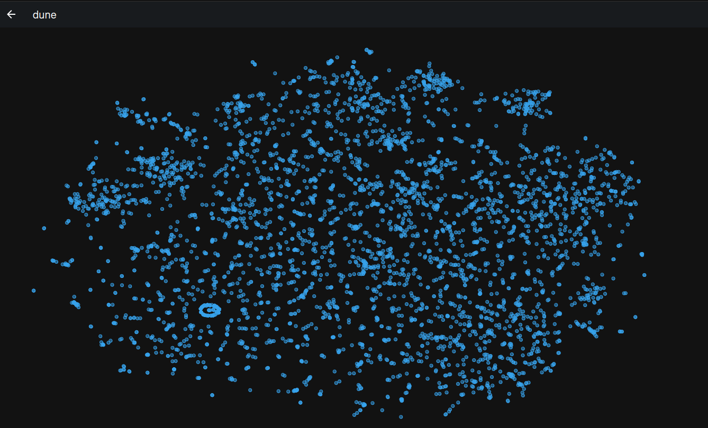

# Fastembed Text Search Demo

## Basic Setup
If you already have Python and Poetry installed, you can skip this step.

- Install pyenv: ``  curl https://pyenv.run | bash ``
- Select Python 3.11 ``pyenv install 3.11 ; pyenv local 3.11``
- Install Poetry `` python -m pip install --user poetry ``


## Qdrant

```shell
docker run -p 6333:6333 -p 6334:6334 qdrant/qdrant
```

Qdrant Dashboard: http://localhost:6333/dashboard

## Test Drive

### Search for information in Dune Novel

1. Vectorize the entire first book. This takes about 5min (measured on my Thinkpad P1 2Gen)

```shell
python run create_embeddings_dune.py
```

In the reduced 2D vector representation in Qdrant UI, the book looks like this:



Remark: The circular structure in the lower left corner is a reminder for keeping the data clean, because it is just a bunch of escaped newlines I didnt remove from the input data. :)

2. Encode a query using the same embedding model and issue a suggestions request. 

```python
query = "query: Whats the name of the imperial planetologist?"
```

```python
[
    ScoredPoint(id='7b900e70-f694-4c73-8fa6-d7687ee39561', version=378, score=0.8934159,
                payload={'text': '"M\'Lord! Kynes is the Imperial Planetologist, His Majesty\'s own serv--"\n'},
                vector=None),
    ScoredPoint(id='9575e48a-0d4f-4fce-8e5b-a30fc9ba137f', version=377, score=0.87138045, payload={
        'text': '"The Imperial Planetologist, Kynes, is involved, m\'Lord. Idaho joined this Kynes under mysterious circumstances . . . I might even say suspicious circumstances."\n'},
                vector=None),
    ScoredPoint(id='61767325-0c6b-437b-b7c3-1245f10bf399', version=848, score=0.8692194, payload={
        'text': 'PORITRIN: third planet of Epsilon Alangue, considered by many Zensunni Wanderers as their planet of origin, although clues in their language and mythology show far more ancient planetary roots.\n'},
                vector=None),
    ScoredPoint(id='90e0de37-267f-4a73-af32-cf06bf3a4c59', version=67, score=0.8672735, payload={
        'text': '"What if it were more than a prison planet, Paul? There\'s a question you never hear asked about the Imperial Corps of Sardaukar: Where do they come from?"\n'},
                vector=None),
    ScoredPoint(id='d62fd158-a731-42b3-b546-c138cff9d9b2', version=289, score=0.8654328,
                payload={'text': '"No, it isn\'t! Where is that stupid planetologist? Where is this man Kynes?"\n'},
                vector=None),
    ScoredPoint(id='9eef6fd9-8743-40bf-b0f8-175c1a042df9', version=831, score=0.86388373,
                payload={'text': "CALADAN: third planet of Delta Pavonis; birthworld of Paul-Muad'Dib.\n"},
                vector=None),
    ScoredPoint(id='3ecd4e41-bb48-4f85-95fb-062a80ae4f35', version=839, score=0.8626296, payload={
        'text': 'HARMONTHEP: Ingsley gives this as the planet name for the sixth stop in the Zensunni migration. It is supposed to have been a no longer existent satellite of Delta Pavonis.\n'},
                vector=None),
    ScoredPoint(id='b2a2ba90-a90e-4533-81fa-d95e0095e7f9', version=805, score=0.8619064,
                payload={'text': '-Pardot Kynes, First Planetologist of Arrakis\n'}, vector=None)]
```

This information can serve as a reduced context for a Language Model.


## Remarks
DMCA Notice: The dune.txt file in this repo is solely for educational purposes and has been copied from a public github repository. If somebody is not comfortable with that, please get in touch, I will remove the file immidiately.
